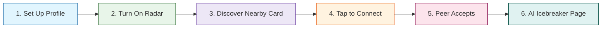

# 📲 TapConnect — Quick & Easy User Guide
### *Say goodbye to "How do you spell your name on LinkedIn?" and hello to effortless professional networking.*

Welcome to **TapConnect**! Whether you are attending a major business conference, a local technology meetup, or working out of a shared co-working office, TapConnect is your digital companion. 

It acts like a **local digital radar**, finding other professionals in the same room, showing you what you have in common, and suggesting a fun way to start a conversation—all without ever needing to search by name.

---

## 🎒 What You Need to Get Started

Before opening the app, make sure your phone is ready:
1. **Android Smartphone**: Ensure your device is powered on and updated.
2. **Bluetooth Enabled**: Turn your phone's Bluetooth **ON**. TapConnect uses Bluetooth to find nearby phones without draining your battery.
3. **Location Services Enabled**: Turn your phone's Location settings **ON**. 
   > [!IMPORTANT]
   > **We value your privacy!** TapConnect *never* tracks your GPS location on a map and does not know where you live. Android simply requires Location Services to be enabled for Bluetooth scanning to work.
4. **Internet Connection**: Ensure you are connected to Wi-Fi or have Mobile Data turned on so our smart AI can generate your custom icebreakers.

---

## 🚶‍♀️ Step-by-Step Guide: How to Use TapConnect

### 👤 Step 1: Create Your Digital Business Card
When you open the app for the first time, you will set up your professional profile. Think of this as your digital business card:
* **Add a Profile Photo**: Upload a clear, friendly photo of yourself so people in the room can easily recognize you.
* **Fill in Your Details**: Enter your **Name**, your **Job Title** (e.g., *Marketing Manager*, *Freelance Designer*), and your **Company/Organization**.
* **Write a Quick Bio**: Share a 1-2 sentence summary of what you do or what you are looking to learn.
* **Add Your Interests**: Select or type in tags that represent your passions (e.g., `AI`, `Investing`, `Web Design`, `Real Estate`, `Photography`). These tags are what the AI will use to match you with others!

---

### 📡 Step 2: Turn on Your Networking Radar
To start discovering or being discovered by others:
1. Go to the **Home** tab (the **Sensor/Radar** icon at the bottom of your screen).
2. You will see a central circular radar screen.
3. Slide the switch at the bottom of the screen to **ON**.
4. The radar will begin to pulse with a beautiful **Emerald Green wave**. This means your phone is now broadcasting your presence to the room and actively looking for other TapConnect users nearby.

---

### 🔍 Step 3: Discover People in the Room
Once your radar is on, walk around the venue or stand near other attendees:
1. Tap the **Discover** tab (the **People** icon at the bottom of your screen).
2. A list of cards will start appearing in real time!
3. Each card represents a real person standing within **30 feet** of you.
4. You can see their photo, name, title, and a list of their interest tags. 
5. The app will automatically highlight any interests you share in common!

---

### 🤝 Step 4: The Digital Handshake ("Tap to Connect")
When you see someone you would like to meet in person:
1. Tap the friendly **"Tap to Connect"** button on their card.
2. Your screen will display a brief "Waiting for response..." status.
3. On *their* phone, a window will instantly slide up saying: **"[Your Name] wants to connect!"**
4. They will see your photo, profile summary, and the interests you both share.

---

### 💬 Step 5: Breaking the Ice with AI
If the other person accepts your connection request (or if you accept one from them):
1. Both of your phones will vibrate and display a celebratory **"Connected!"** screen.
2. TapConnect’s built-in **AI Wingman** will immediately read both of your profiles and generate a customized, 1-sentence **AI Icebreaker** conversation starter!
   * *Example:* **"Hey Sarah! Why don't you ask Dave about his thoughts on Web Design, since you are both passionate about UX?"**
3. Look up, find them in the room (using their profile photo), walk over, and use the icebreaker to kickstart an organic, friendly face-to-face conversation!

---

## 🛠️ Troubleshooting (FAQ)

#### ❓ "Why is my Discover list empty? I don't see anyone."
* **Distance**: Are there other TapConnect users within 30 feet of you? Ensure you are close to other attendees.
* **Radar Switch**: Make sure both **you** and the **other person** have slid the radar switch to **ON** (showing the green pulsing animation).
* **Bluetooth Check**: Make sure your phone's Bluetooth is turned ON in your phone's system settings.
* **Location Permission**: Ensure you granted the app permission to access "Location" on startup. (Remember: we don't track your map coordinates, it is just required by your phone to scan for Bluetooth signals!).

#### ❓ "Does this track where I go when I leave the event?"
* **Absolutely not.** TapConnect only works in short-range physical spaces using Bluetooth. Once you slide your Radar switch **OFF** or close the app, all scanning stops immediately, and your phone stops broadcasting. We have zero interest in tracking your location history.

#### ❓ "How do I review the people I met yesterday?"
* Go to the **Profile** tab (the **Person** icon).
* You will see your **Connection History** archive.
* This lists every person you connected with, along with their business cards, the date you met, and the AI icebreaker matching reports, so you can easily follow up with them on email or LinkedIn later.

---

## 💡 Top Tips for Networking Like a Pro

* **Be Specific with Tags**: Instead of just putting `Business`, try adding specific interests like `SaaS Startups`, `B2B Marketing`, or `Angel Investing`. The more specific your tags, the more creative and personal your AI icebreakers will be!
* **Keep Your Radar Active**: When walking into a new presentation hall or coffee break area, keep your radar switched on so you can capture connections in the background without needing to look at your screen.
* **Review at the End of the Day**: Use your Connection History tab to review everyone you met before sending your follow-up emails. It will jog your memory on exactly what you talked about!
